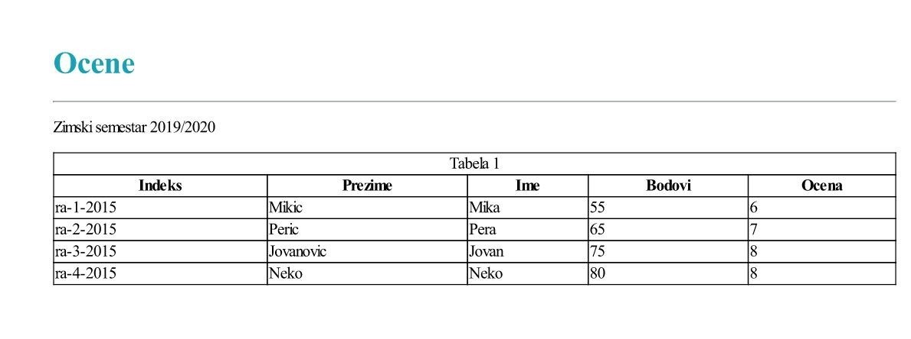

# DSL for data visualization

license goes here

## Description

DSL for data visualization is created for the purpose of the Domain-Specific Lanugages course at the Faculty of Technical Sciences, University of Novi Sad.

It enables data visualization for:

- Headers
- Images
- Normal texts
- Tables
- Charts
- Horizontal lines

DSL script is provided as input and then the preview of the document is generated as HTML file, and after that the HTML is converted to PDF.

## Example

This is a short example of a DSL script which contains a header, horizontal line, normal text and table. More examples are available in the examples folder of the repository.

### Document example (document3.docv)
```
data studenti = "SELECT * FROM studenti"
header H1 blue = "Ocene"
line blue
text = "Zimski semestar 2019/2020"
table 
[
    datasource studenti
    num-row=4
    title="Tabela 1"
    select = ({{Indeks}}, {{Prezime}}, {{Ime}}, {{Bodovi}}, {{Ocena}},)
]
```
### Generated document example



## Instructions
1. Install requirements
```
$ pip install -r requirements.txt
```
2. ...

## Technologies used
- Python 3.6+
- [textX](https://github.com/textX/textX)
- Jinja2 template engine

## Contributors

- [Miloš Krstić](https://github.com/KrsticM/)
- [Jelena Šurlan](https://github.com/jaseyrae9)
