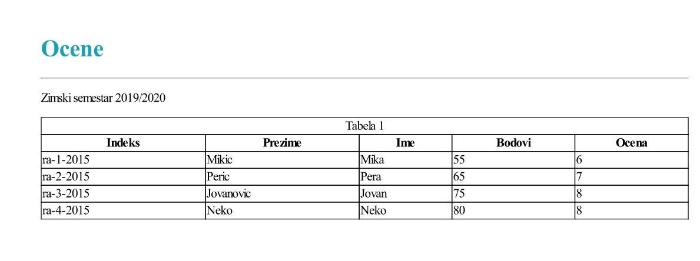
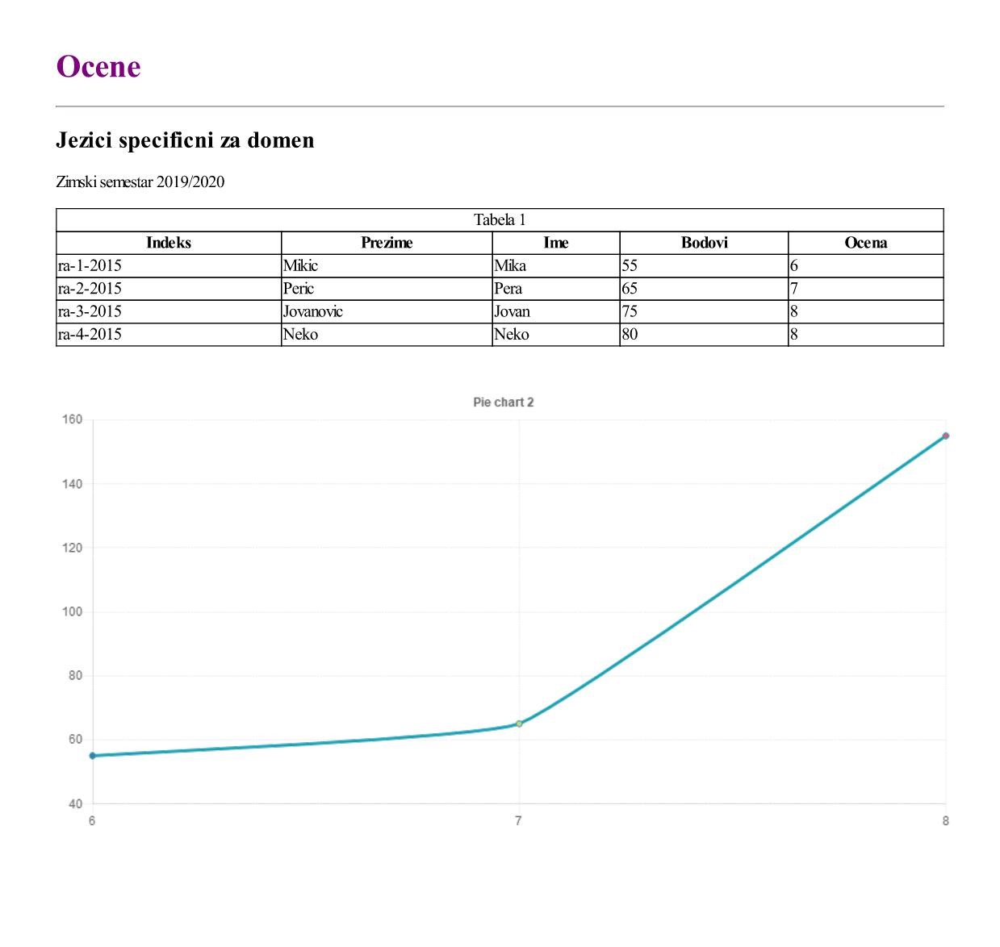

# Examples

## First example (document.docv)
DSL script which contains a header, horizontal line, image, subheader, normal text, table and piechart. 

### Document example
```
data studenti = "SELECT * FROM studenti"
header H1 blue = "Ocene"
line blue
image = "https://i.imgur.com/vHrSBSi.jpg"
header H2 pink = "Jezici specificni za domen"
text = "Zimski semestar 2019/2020"
table 
[
    datasource studenti
    num-row=4
    title="Tabela 1"
    select = ({{Indeks}}, {{Prezime}}, {{Ime}}, {{Bodovi}}, {{Ocena}},)
]
piechart
[
    title="Pie chart 1"
    datasource studenti
    series-select
    [
        label={{Ocena}}
        value=Count({{Ocena}})
    ]
]
```

### Generated document example


## Second example (document3.docv)
DSL script which contains a header, horizontal line, normal text and table. 

### Document example
```
data studenti = "SELECT * FROM studenti"
header H1 blue = "Ocene"
line blue
text = "Zimski semestar 2019/2020"
table 
[
    datasource studenti
    num-row=4
    title="Tabela 1"
    select = ({{Indeks}}, {{Prezime}}, {{Ime}}, {{Bodovi}}, {{Ocena}},)
]
```
### Generated document example


## Third example (document4.docv)
DSL script which contains a header, horizontal line, subheader, normal text, table and linechart. 

### Document example
```
data studenti = "SELECT * FROM studenti"
header H1 purple = "Ocene"
line purple
header H2 = "Jezici specificni za domen"
text = "Zimski semestar 2019/2020"
table 
[
    datasource studenti
    num-row=4
    title="Tabela 1"
    select = ({{Indeks}}, {{Prezime}}, {{Ime}}, {{Bodovi}}, {{Ocena}},)
]
linechart
[
    title="Pie chart 2"
    datasource studenti
    series-select
    [
        label={{Ocena}}
        value=Sum({{Bodovi}})
    ]
]
```
### Generated document example

